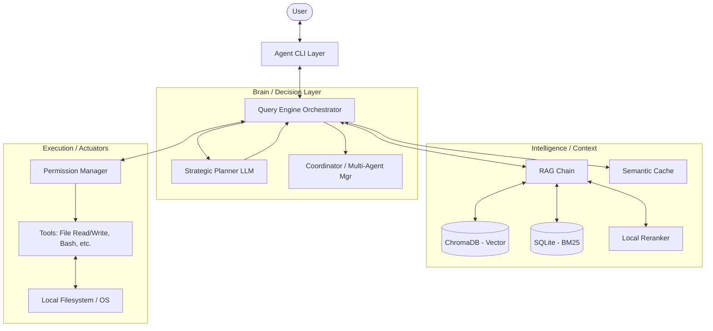

# Architecture Document: Antigravity Agentic System

## 1. Executive Summary
- **What the system does**: An autonomous AI software engineering agent designed for codebase analysis, research, and surgical code modification on Windows systems.
- **Who it is for**: Software engineers and developers requiring a high-fidelity, autonomous assistant CAPABLE of complex multi-turn reasoning and RAG-driven context awareness.
- **Key architectural style**: **Layered Agentic Orchestration** with a separation between strategic planning (Planner) and tactical execution (Execution Engine), supplemented by a Hybrid RAG pipeline.

---

## 2. High-Level Architecture
The system follows a modular, layer-based architecture designed for high responsiveness (Fast-Path CLI) and robust autonomous operations.

- **Interface Layer**: Handles user interaction and session lifecycle.
- **Orchestration Layer**: The central brain managing the Agentic Loop (Plan -> Act -> Verify).
- **Cognitive Tools & RAG**: Specialized modules for retrieval, semantic caching, and intent classification.
- **Infrastructure Context**: Manages the OS environment, file manipulation, and safety (permissions).

---

## 3. Component Breakdown

### 3.1 Interface Layer (`cli.py`, `backend.py`)
- **Responsibility**: Provides a Rich console UI, handles session persistence, and performs "Background Hydration" of the engine to minimize perceived latency.
- **Key Components**: `AgentCLI` class, Startup Profiler.
- **Interactions**: Sends user queries to `QueryEngine`; receives structured events (status, chunks, tool calls).

### 3.2 Orchestration Layer (`query_engine.py`)
- **Responsibility**: Implements the **F-01 Agentic Loop**. It uses a separate "Planner" LLM to decide on actions and a "Worker" LLM for execution.
- **Key Components**: `QueryEngine`, `Planner`, `Coordinator` (Multi-Agent management).
- **Interactions**: Orchestrates between `HistoryManager`, `ContextManager`, `RAGChain`, and `Tools`.

### 3.3 Retrieval Engine (`rag_chain.py`, `backend.py`)
- **Responsibility**: Performs **Hybrid Search** (Vector + BM25) and re-ranking to provide relevant code context.
- **Key Components**: `SQLiteFTS5BM25`, `LocalReRanker` (Cross-Encoder), `SemanticCache`.
- **Interactions**: Fed by `backend.py` (ingestion); consumed by `QueryEngine` during the "RAG" phase.

### 3.4 Data Ingestion Layer (`backend.py`)
- **Responsibility**: Processes codebase files using **AST-aware chunking** (via Tree-sitter) to preserve logical code units.
- **Key Components**: `CodeASTChunker`, `RecursiveCharacterTextSplitter`.
- **Interactions**: Populates ChromaDB and SQLite FTS5 tables used by the RAG layer.

---

## 4. Data Flow
1. **Request**: User inputs a query via `AgentCLI`.
2. **Strategy**: `QueryEngine` calls the **Planner** to decide if the task requires:
    - **RAG**: Search the codebase for context.
    - **TOOL**: Direct file manipulation or command execution.
    - **FINAL**: Respond to the user.
3. **Context Retrieval (if RAG)**: `RAGChain` performs hybrid search (Chroma + SQLite), re-ranks results with a Cross-Encoder, and injects results into the `SystemMessage`.
4. **Action (if TOOL)**: `QueryEngine` validates the tool call via `PermissionManager`. If approved, `tools.py` executes the OS-level command.
5. **Observation**: Results from tools are fed back into the conversation history as `ToolMessage`.
6. **Iteration**: The loop repeats until the **Planner** emits a "final" action.
7. **Streaming**: Real-time status updates and token chunks are streamed back to the `AgentCLI` for a "live" feel.

---

## 5. Technology Stack
- **Core Logic**: Python 3.10+
- **Agent Framework**: Custom Orchestrator built on **LangChain Core**.
- **LLM Abstraction**: OpenRouter (Cloud LLMs), Ollama (Local/Cloud).
- **Vector Storage**: **ChromaDB**.
- **Full-Text Search**: **SQLite FTS5** (built-in, high-performance BM25).
- **Syntax Analysis**: **Tree-sitter** (logical chunking).
- **UI/UX**: `Rich`, `Prompt-Toolkit`.

---

## 6. Design Patterns & Practices
- **Planner/Actuator Pattern**: Decouples strategic decision-making (low-temp fast LLM) from creative execution (higher-temp capable LLM).
- **Singleton Pattern**: Used for heavy models (Embeddings, Reranker) to prevent memory leaks and initialization latency.
- **Journaling (JSONL)**: Turn-by-turn persistence for crash resiliency during long autonomous sessions.
- **Tombstone Recovery**: Logic to "burn" (discard) poisoned history if a tool execution or stream fails.
- **Lazy Loading**: Heavy imports are deferred until needed to improve CLI cold-start speed.

---

## 7. Deployment Architecture
- **Environment**: Primarily local development machines (Windows focus evidenced by `win32` checks).
- **State**: Persistent local storage in `.sessions/` and `chroma_db/`.
- **Compute**: Hybrid—Local embedding/search/reranking + Cloud-based LLM inference (via OpenRouter/Ollama Cloud).

---

## 8. Risks & Issues
- **Code Smell (Global State)**: `current_engine` is used as a global reference in `tools.py`, which may complicate unit testing or multi-session scaling in the same process.
- **Scalability**: High-memory usage for local Cross-Encoders (`LocalReRanker`) might strain devices with limited RAM.
- **Security**: The "AUTO" permission mode for Workers (used in multi-agent delegation) could be a risk if a sub-agent executes destructive shell commands without oversight.

---

## 9. Improvement Suggestions
- **Process Isolation**: Move tool execution (`tools.py`) into isolated sandboxes (Docker/VMs) to mitigate the risk of destructive AI-driven `bash/edit` actions.
- **Dependency Optimization**: Standardize the mix of `rank_bm25` (legacy) and `SQLiteFTS5` to reduce library bloat.
- **Async Migration**: Much of the RAG pipeline is synchronous; moving to `asyncio` would significantly improve throughput during parallel multi-agent tasks.

---

## 10. Visual Diagram

