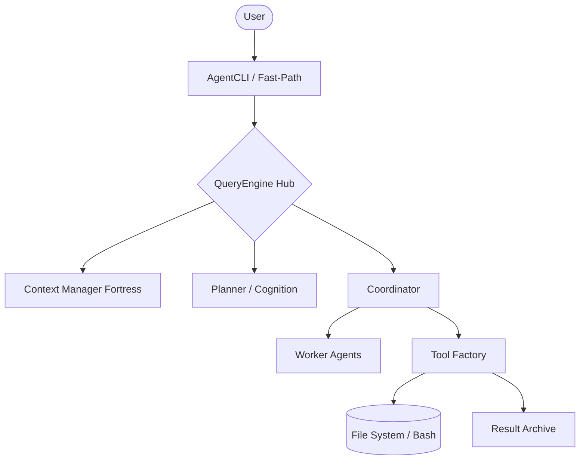

# Architecture Document: Antigravity Agent Core (v2.4.1)

## 1. Executive Summary
**Antigravity** is a production-grade, state-aware AI coding assistant designed for autonomous navigation and manipulation of large-scale codebases. It is built to achieve 100% architectural parity with the Anthropic Claude Code system, prioritizing **Prompt Cache Stability**, **Context Integrity**, and **Fail-Closed Security**.

- **Purpose**: Autonomous engineering agent for RAG search, code editing, and system diagnostics.
- **Architectural Style**: State-Machine Logic with Multi-Agent Coordination.

---

## 2. High-Level Architecture
The system follows a layered, hub-and-spoke model where the **QueryEngine** acts as the central orchestrator (Hub), managing specialized spokes for cognition, context, and environment interaction.

[User Interface (CLI)]  
      ↕  
[Fast-Path Dispatcher / Profiler]  
      ↕  
[QueryEngine (Orchestrator)] ─── [Coordinator / Workers]  
      │  
      ├─ [5-Layer Context Fortress]  
      ├─ [Fail-Closed Tool Registry]  
      └─ [RAG / Project Memory]

---

## 3. Component Breakdown

### 3.1 CLI & Entrypoint (cli.py)
*   **Responsibility**: Fast-path utility dispatching and UI rendering.
*   **Key Features**:
    *   **Fast-Path Dispatcher**: Intercepts utility commands (`--version`, `doctor`) without loading heavy LLM libraries.
    *   **Startup Profiler**: Monitors boot latency (50ms SLA).
    *   **Lazy Loading**: Hydrates `rich` and `langchain` only when a full session begins.

### 3.2 QueryEngine (query_engine.py)
*   **Responsibility**: The primary Agentic Loop (F-01).
*   **Key Logic**:
    *   **QueryState**: A state-machine tracking turns, history, and strategic plans.
    *   **Grooming Phase**: Pre-query history sanitization and plan-injection.
    *   **Tombstone Handler**: Atomic turn recovery that purges orphaned messages/processes on failure.

### 3.3 Context Fortress (context_manager.py)
*   **Responsibility**: Tiered context window protection.
*   **Layers**:
    1.  **Budgeting**: Offloads large tool results to disk (`ResultArchive`).
    2.  **Microcompact**: Sanitizes syntactic noise.
    3.  **Context Collapse**: Merges repetitive tool chains.
    4.  **Snip**: Surgical removal of distant history segments.
    5.  **Autocompact**: Summary-based emergency reduction.

### 3.4 Multi-Agent Coordinator
*   **Responsibility**: Task delegation and focus isolation.
*   **Roles**:
    *   **Coordinator**: High-level manager orchestrating workers.
    *   **WorkerAgent**: Isolated sub-agents with 10k context focus and auto-permissions.

### 3.5 Tool Registry (tools.py)
*   **Responsibility**: Secure capability deployment.
*   **Infrastructure**:
    *   **build_tool Factory**: Mandatory gateway enforcing `is_read_only` and `is_concurrency_safe` defaults.
    *   **Deterministic Sorting**: Alphabetic tool ordering to stabilize LLM Prompt Caching.

---

## 4. Data Flow
1.  **Input**: User query received via CLI.
2.  **GroomPhase**: Current project state and Master Plan are injected into history.
3.  **Planning**: LLM generates a Strategic Plan for the current turn.
4.  **Execution**: `Coordinator` spawns a `Worker` or triggers a `Tool`.
5.  **Validation**: `PermissionManager` gates destructive actions.
6.  **Archiving**: Large outputs are offloaded to disk; history is checkpointed for **Undos**.
7.  **Output**: Streamed result with `Tombstone` recovery if the connection breaks.

---

## 5. Technology Stack
*   **Core**: Python 3.10+
*   **Orchestration**: LangChain (Messages, Tool-Binding)
*   **Cognition**: Claude 3.5 Sonnet (default) via OpenRouter/Ollama
*   **Memory**: ChromaDB (Vector) + SQLite (FTS5)
*   **TUI**: Rich + PromptToolkit
*   **Security**: Custom Regex-based Path Sentinel + Fail-Closed Factory

---

## 6. Design Patterns
*   **Strategy Pattern**: Tiered Context Pipeline (Layer 1-5).
*   **Factory Pattern**: `build_tool` security gateway.
*   **State Machine**: `QueryState` turn management.
*   **Coordinator Pattern**: Manager-Worker agent delegation.
*   **Memento Pattern**: File snapshots for surgical standard undo.

---

## 7. Risks & Issues
*   **Import Tax**: Python's global import state requires lazy-loading vigilance to stay under the 50ms boot SLA.
*   **Race Conditions**: Handled via **Process Discard** during Tombstone failure recovery.
*   **Strategic Drift**: Addressed via **AutoDream Reflection** and Plan-Injection.

---

## 8. Improvement Suggestions
*   **Parallel Execution**: Upgrade Coordinator to use `asyncio` for simultaneous worker spawning.
*   **Telemetry**: Integrate OpenTelemetry for high-fidelity turn tracking and cost auditing.

---

## 9. System Diagram

