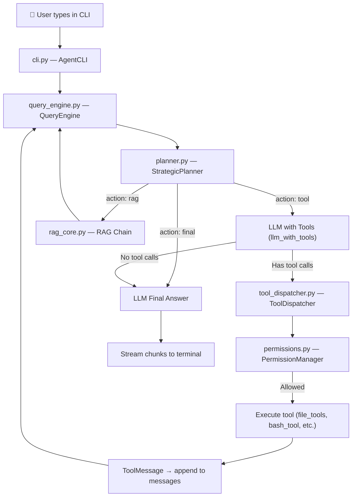

# How the Agent System Works — End-to-End Walkthrough

## Architecture Overview



---

## Step-by-Step: What happens when you run `python cli.py`

### 1. Boot Phase (instant)

```
python cli.py --model ollama-cloud:gpt-oss:120b-cloud
```

| Step | What happens | File |
|------|-------------|------|
| 1a | Fast-path dispatcher checks `--version` / `--help` (exits early if matched) | [cli.py](file:///F:/Gemini_anti/super-cdoing-tool-system/new_sysy/cli.py#L9-L18) |
| 1b | `AgentCLI.__init__()` is called. It immediately spawns a **background thread** to boot the heavy engine | [cli.py](file:///F:/Gemini_anti/super-cdoing-tool-system/new_sysy/cli.py#L97-L98) |
| 1c | The UI (`prompt_toolkit` prompt) appears **instantly** — you can start typing before the engine is ready | [cli.py](file:///F:/Gemini_anti/super-cdoing-tool-system/new_sysy/cli.py#L100-L114) |
| 1d | Background thread: loads `QueryEngine`, which loads the LLM, planner, tools, RAG chain, etc. | [cli.py](file:///F:/Gemini_anti/super-cdoing-tool-system/new_sysy/cli.py#L116-L140) |

You see a panel like:
```
🤖 Autonomous Engineering Agent
Session: default_session
Model: ollama-cloud:gpt-oss:120b-cloud
Hydration: Background Tick...
```

---

### 2. You type: `hello who are you`

The prompt session captures your input. Since it's not a slash-command (`/model`, `/help`) or `exit`/`clear`, it goes to the **agent turn**.

If the engine isn't ready yet, you'll see a spinner: `Warming up query engine...`

---

### 3. `run_agent_turn()` → `QueryEngine.process_query_stream()`

[query_engine.py:202](file:///F:/Gemini_anti/super-cdoing-tool-system/new_sysy/query_engine.py#L202-L260)

This is the **agentic loop**. Here's what happens:

#### 3a. Message Initialization
Since this is the first query, `messages` is empty. The engine creates:
```python
messages = [
    SystemMessage(content="""
        You are an autonomous AI software engineer operating on a Windows system.
        You have access to tools: list_directory, code_search, file_read, file_write, file_edit, bash...
        
        [MASTER_PLAN_SCRATCHPAD]
        No plan defined yet.
        [/MASTER_PLAN_SCRATCHPAD]
    """)
]
```

Then appends your query:
```python
messages.append(HumanMessage(content="hello who are you"))
```

#### 3b. Pre-Query Grooming
[query_engine.py:188](file:///F:/Gemini_anti/super-cdoing-tool-system/new_sysy/query_engine.py#L188-L200)

Before every turn, the engine:
1. Runs `ContextManager.compact()` — prunes old context if needed
2. Prepends the full system prompt (RAG instructions + master plan + memory instructions)
3. Replaces or inserts the `SystemMessage` at position 0

#### 3c. Context Safety Check
[query_engine.py:265](file:///F:/Gemini_anti/super-cdoing-tool-system/new_sysy/query_engine.py#L265-L277)

Checks if the message history is too large for the model's context window. For a first turn with "hello who are you", this is trivially fine.

---

### 4. The Planner Decides the Action

[planner.py](file:///F:/Gemini_anti/super-cdoing-tool-system/new_sysy/planner.py#L28-L103)

The `StrategicPlanner` is a **separate LLM call** that looks at:
- The last 5 messages
- Previous actions taken
- The user's request

It returns a JSON decision:

```json
{
    "action": "tool",
    "input": "",
    "reason": "User is asking a greeting/identity question. Respond directly."
}
```

For "hello who are you", the planner will almost certainly choose `"tool"` (which means: let the main LLM handle it with tool access), since there's no file work or RAG lookup needed.

> [!NOTE]
> The planner can also return `"rag"` (search the knowledge base) or `"final"` (give a definitive answer). For a simple greeting, it picks `"tool"`.

---

### 5. The Main LLM is Invoked

[query_engine.py:332](file:///F:/Gemini_anti/super-cdoing-tool-system/new_sysy/query_engine.py#L331-L342)

```python
response = self.llm_with_tools.invoke(messages)
```

This sends the full message array to the model (via **Ollama Cloud** or **OpenRouter**, depending on the model prefix):

| Model Prefix | Backend | File |
|---|---|---|
| `ollama:` | Local Ollama server (`localhost:11434`) | [llm_factory.py:117](file:///F:/Gemini_anti/super-cdoing-tool-system/new_sysy/llm_factory.py#L117-L126) |
| `ollama-cloud:` | Ollama Cloud API (`OLLAMA_CLOUD_BASE_URL`) | [llm_factory.py:129](file:///F:/Gemini_anti/super-cdoing-tool-system/new_sysy/llm_factory.py#L129-L144) |
| Everything else | OpenRouter (`openrouter.ai/api/v1`) | [llm_factory.py:147](file:///F:/Gemini_anti/super-cdoing-tool-system/new_sysy/llm_factory.py#L147-L175) |

The default model is `ollama-cloud:gpt-oss:120b-cloud`, which routes through **Ollama Cloud**.

The LLM receives:
1. **System prompt**: "You are an autonomous AI software engineer..."
2. **User message**: "hello who are you"
3. **Tool definitions**: All registered tools (file_read, file_write, bash, glob, etc.)

---

### 6. The LLM Response — No Tool Calls

For "hello who are you", the model will respond with **text only** (no tool calls). Something like:

> "Hello! I'm an autonomous AI software engineering assistant. I can help you with reading, writing, and editing code files, running shell commands, searching codebases, and more. How can I help you today?"

Since `response.tool_calls` is empty:
```python
if not response.tool_calls:
    state.is_terminal = True  # Stop the loop
    action = "final"
```

---

### 7. Final Answer Generation

[query_engine.py:409-418](file:///F:/Gemini_anti/super-cdoing-tool-system/new_sysy/query_engine.py#L409-L418)

The engine makes **one more LLM call** with a final prompt:
```
"You are finishing the task. Provide a clear final answer and summarize any changes."
```

This produces the polished final answer, which is streamed back as `{"type": "chunk", "content": "..."}` events.

---

### 8. CLI Renders the Output

[cli.py:285-296](file:///F:/Gemini_anti/super-cdoing-tool-system/new_sysy/cli.py#L285-L296)

Back in `run_agent_turn()`, the CLI:
1. Shows a status spinner while the LLM is thinking: `🧠 Thinking: Processing...`
2. When chunks arrive, prints them with a pipe prefix:
   ```
   │ Hello! I'm an autonomous AI software engineering assistant...
   ```
3. On `"done"` event, saves the session history

---

### 9. Session Persistence

After the turn:
- The full message history is saved via `SessionJournal.save_session()` to [sessions/](file:///F:/Gemini_anti/super-cdoing-tool-system/new_sysy/sessions)
- The `DreamEngine.reflect_and_learn()` runs to extract learnings from the conversation

---

## What If You Asked Something Harder?

If instead of "hello" you asked **"read the config.py file and explain it"**, the flow diverges:

1. **Planner** → `{"action": "tool"}` (needs file access)
2. **LLM** → returns a tool call: `file_read(file_path="config.py")`
3. **ToolDispatcher** → checks permissions → asks you: `🔑 PERMISSION: Allow file_read?`
4. You press `y` → tool executes → file contents returned as `ToolMessage`
5. **Loop continues** → LLM now has the file content → generates explanation
6. **No more tool calls** → `action = "final"` → answer streamed to terminal

---

## Component Summary

| Component | File | Purpose |
|---|---|---|
| CLI Shell | [cli.py](file:///F:/Gemini_anti/super-cdoing-tool-system/new_sysy/cli.py) | Terminal UI with rich formatting, prompt_toolkit input |
| Query Engine | [query_engine.py](file:///F:/Gemini_anti/super-cdoing-tool-system/new_sysy/query_engine.py) | Main agentic loop (up to 15 turns per query) |
| Strategic Planner | [planner.py](file:///F:/Gemini_anti/super-cdoing-tool-system/new_sysy/planner.py) | Decides next action: `tool`, `rag`, or `final` |
| LLM Factory | [llm_factory.py](file:///F:/Gemini_anti/super-cdoing-tool-system/new_sysy/llm_factory.py) | Creates LLM instances (Ollama local/cloud, OpenRouter) |
| Tool Dispatcher | [tool_dispatcher.py](file:///F:/Gemini_anti/super-cdoing-tool-system/new_sysy/tool_dispatcher.py) | Permission-gated tool execution |
| Tool Registry | [tool_registry.py](file:///F:/Gemini_anti/super-cdoing-tool-system/new_sysy/tool_registry.py) | `@register_tool` decorator, path validation |
| RAG Core | [rag_core.py](file:///F:/Gemini_anti/super-cdoing-tool-system/new_sysy/rag_core.py) | Retrieval-Augmented Generation with ChromaDB |
| Config | [config.py](file:///F:/Gemini_anti/super-cdoing-tool-system/new_sysy/config.py) | All model IDs, paths, tuning knobs |
| Context Manager | [context_manager.py](file:///F:/Gemini_anti/super-cdoing-tool-system/new_sysy/context_manager.py) | History compaction to stay within token limits |
| Permissions | [permissions.py](file:///F:/Gemini_anti/super-cdoing-tool-system/new_sysy/permissions.py) | Security: allow/ask/deny per tool |
| Dream Engine | [dream_engine.py](file:///F:/Gemini_anti/super-cdoing-tool-system/new_sysy/dream_engine.py) | Post-session learning/reflection |

---

## Key Design Patterns

1. **Greedy UI Boot**: The terminal appears instantly; heavy imports happen in a background thread
2. **Planner-First Architecture**: Every turn starts with a separate LLM call to the planner to decide *what kind* of action to take
3. **Agentic Loop**: The engine loops up to 15 turns per user query — each turn can involve a tool call + result + another LLM call
4. **Ghost History**: Old AI responses are truncated to save tokens while keeping recent context fresh
5. **Sentinel Summarization**: After enough turns, a background thread summarizes the conversation state
6. **Permission Gating**: Destructive tools (bash, file_write, file_edit) require user approval
